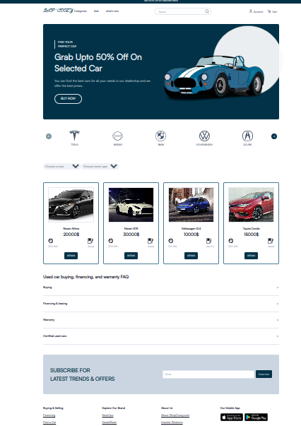

# E-CAR
This is an application designed for car sell management .
### 1-Landing page
There is a landing page where a lambda user can :
* find car list 
* filter cars by brand,color,motor type
* see car details and take an appointment if interested

### 2-Admin dashboard
This is a secured page that is only available for athenticated admin. 

In this page ,the admin can:
* the add a sub admin

* Validate or reject appointment made by 
users 
* Add new car (that will be available into the landing page)

* Delete car on the list when it's not available anymore

#### user:

### appointment :

### car:
